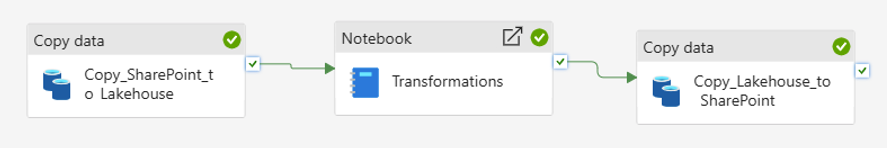

# Fabric SharePoint ETL Pipeline

An automated daily Excel processing workflow built with Microsoft Fabric, SharePoint, Lakehouse, Python, and Fabric Data Pipelines.

## Overview

This project demonstrates how a repetitive, manual Excel-based business process can be transformed into an automated data workflow.

The source process consists of a daily cumulative Excel export containing historical data up to the previous day. 
- when I was first presented the problem, my colleague charged with this task used to manually open the workbook, filter the required records, clean the structure, correct the formatting, save the result, and then redistribute the file
- this costed her about half an hour daily, plus a couple of episodes where manual mistakes compromised the correct functioning of other business´ reports
  - in fact, this file is in the end used as one of the sources of a Power-BI Report
- the workflow presented in this repo performs these operations automatically.

The solution uses Microsoft SharePoint as the operational file location, Microsoft Fabric for orchestration and staging, and Python for the transformation and Excel-specific formatting logic.

## Business Problem

The original daily process required a user to manually:

1. Receive a cumulative Excel export.
2. Upload or access the file in a shared Microsoft Teams / SharePoint folder.
3. Remove historical records that were not required for the daily process.
4. Keep only records belonging to the previous calendar day.
5. Remove unnecessary rows and columns from the source workbook.
6. Correct date formatting.
7. Correct numeric and percentage formatting.
8. Save the processed workbook.
9. Make the final file available again in the shared folder.

Although the individual transformations were relatively simple, the process was repetitive, time consuming, and susceptible to human error.

## Solution

I redesigned the process as an automated Microsoft Fabric workflow:

```text
Daily Excel Export
        |
        v
Microsoft Teams / SharePoint
        |
        v
Fabric Data Pipeline
        |
        v
Lakehouse Staging
        |
        v
Python Transformation
(pandas + openpyxl)
        |
        v
Data Validation
        |
        v
Formatted Excel Output
        |
        v
Microsoft SharePoint / Teams
```

The user-facing process is therefore reduced to what was originally Step 9 of their process: placing the daily source file in the designated shared folder.
- the remaining processing steps are now handled by the data pipeline.

## Architecture

The solution consists of three main pipeline activities.

```text
Copy SharePoint -> Lakehouse
            |
            | On Success
            v
Transform Excel
            |
            | On Success
            v
Copy Lakehouse -> SharePoint
```

### Microsoft Fabric Pipeline

The workflow is orchestrated through a Microsoft Fabric Data Pipeline composed of three sequential, success-dependent activities.



The pipeline consists of three main stages:

1. **SharePoint to Lakehouse** — copies the source Excel workbook from SharePoint into the Fabric Lakehouse staging area.
2. **Transformation** — processes, validates, and formats the workbook using Python.
3. **Lakehouse to SharePoint** — publishes the validated Excel output back to the SharePoint location.

Each downstream activity is triggered only after the successful completion of the previous activity, preventing invalid or incomplete outputs from being distributed.

### 1. SharePoint to Lakehouse

The original Excel workbook is temporary copied from the SharePoint-backed Microsoft Teams folder into a Microsoft Fabric Lakehouse
- the Lakehouse acts as a temporary staging area between the source system and the transformation layer.

The workbook is copied in binary format, so that Fabric does not attempt to interpret or modify the Excel structure during ingestion.

### 2. Transformation

A Microsoft Fabric Notebook processes the staged workbook using Python.

The transformation uses:

- `pandas` for tabular data manipulation;
- `openpyxl` for Excel-specific formatting and workbook handling.

The notebook dynamically determines the required processing date and keeps only records where:

```text
Calendar Date = TODAY - 1
```

No processing date is hardcoded.

### 3. Lakehouse to SharePoint

After successful transformation and validation, the generated Excel workbook is copied from the Lakehouse back to the SharePoint / Teams folder.

The downstream copy activity is configured to execute only after the transformation activity succeeds
- this prevents an unsuccessful transformation from being distributed as a valid output file.

## Transformation Logic

The transformation performs the following operations:

### Input Validation

The notebook first verifies that the expected input workbook exists in the Lakehouse.

If the input file is unavailable, processing should not continue.

```python
import os

input_file = "/lakehouse/default/Files/Temp/Acquisition.xlsx"

if not os.path.exists(input_file):
    raise FileNotFoundError(f"Input file not found: {input_file}")

print("Input file found:", input_file)
print(
    "File size:",
    round(os.path.getsize(input_file) / 1024 / 1024, 2),
    "MB"
)
```

### Header Handling

The source Excel workbook contains empty rows before the actual table headers
- to ensure the data is loaded correctly, the transformation skips these rows and uses the fourth Excel row as the dataframe header by setting `header=3`

The loaded dataframe is then inspected to verify the number of rows, columns, column names, and a sample of the imported data

```python
df = pd.read_excel(input_file, header=3)

print("Numero righe dati:", len(df))
print("Numero colonne:", len(df.columns))

print("\nIntestazioni:")
print(df.columns.tolist())

display(df.head())
```

This ensures that the dataframe is created with the structure required by the downstream Power BI semantic model and the reports built on top of it.

### Column Cleanup

Similarly to the previous step, empty columns are removed from the source dataset as well

```python
df = df.drop(columns=["Unnamed: 0", "Unnamed: 1"])

print("Numero colonne dopo la pulizia:", len(df.columns))
print("\nIntestazioni:")
print(df.columns.tolist())

display(df.head())
```

After the cleanup, `Calendar Date` becomes the first column of the output dataset

### Date Conversion

`Calendar Date` is converted to a proper datetime datatype before filtering.

### Dynamic Processing Date

The notebook calculates the required date dynamically:

```text
target_date = current_date - 1 day
```

This allows the same workflow to run every day without manually changing the processing date.

### Daily Filtering

Only records matching the calculated previous-day date are retained.

During development testing, the source workbook contained approximately 54,000 historical rows, while the daily filtered output contained approximately 200 rows.

### Data Quality Validation

Before generating the final workbook, the transformation validates that:

- the filtered dataset is not empty;
- only one calendar date remains;
- the remaining date matches the expected previous-day value.

If these conditions are not satisfied, the transformation raises an error instead of silently producing an incorrect output.

### Excel Generation

The validated dataframe is written to a new Excel workbook.

The output workbook contains only the required business columns and records.

### Excel Formatting

Excel-specific formatting is applied after the dataframe has been exported.

This includes:

- date formatting;
- numeric formatting;
- removal of unwanted currency formatting;
- two-decimal formatting for selected numeric columns;
- percentage formatting for margin values.

The output values remain numeric rather than being converted to formatted text.

This allows Microsoft Excel to display numbers according to the user's regional settings.

For example, the same numeric value may appear as:

```text
80.52
```

in an English Excel environment and:

```text
80,52
```

in a German Excel environment.

## Technologies

- Microsoft Fabric
- Fabric Data Factory / Data Pipelines
- Fabric Lakehouse
- Fabric Notebooks
- Python
- pandas
- openpyxl
- Microsoft SharePoint
- Microsoft Teams
- Git / GitHub

## Key Engineering Decisions

### Binary File Transfer

Excel workbooks are transferred between SharePoint and the Lakehouse as binary files.

The pipeline is responsible for moving the workbook, while the Notebook is responsible for interpreting and modifying its contents.

This separates file transport from transformation logic.

### Lakehouse Staging Layer

The original SharePoint workbook is not transformed directly.

Instead, it is first staged in the Lakehouse.

This provides a controlled intermediate processing location and avoids modifying the source file before the transformation has completed successfully.

### Success-Based Dependencies

Pipeline activities are connected using success conditions.

```text
Ingestion
   |
   | Success
   v
Transformation
   |
   | Success
   v
Delivery
```

If ingestion fails, transformation does not start.

If transformation fails, the processed file is not delivered to SharePoint.

### Explicit Data Validation

The pipeline does not assume that the source export always contains valid data.

The transformation explicitly verifies the expected processing date and row availability before producing the final output.

### Production Optimization

Before considering the workflow production-ready, the following options should be investigated:

- Microsoft Fabric Spark Starter Pool configuration;
- Spark session initialization behavior;
- session reuse / high-concurrency execution where applicable;
- Notebook environment configuration;
- alternative lightweight execution mechanisms for small Excel workloads.

The objective is not only to reduce execution time, but also to make daily runtime predictable.

## Current Status

The complete workflow has been successfully tested end-to-end:

```text
SharePoint
    |
    v
Lakehouse
    |
    v
Python Transformation
    |
    v
Validated Excel Output
    |
    v
SharePoint
```

The current development version writes the processed workbook using a separate test filename so that the original source workbook is not overwritten during validation.

## Production Readiness

The core workflow is functional.

Before production deployment, the following items remain to be completed:

- validate production-safe replacement of the original SharePoint file;
- investigate and reduce Notebook cold-start latency;
- define the production execution schedule or trigger;
- finalize error-handling behavior;
- validate the workflow with additional daily source files;
- separate development/test configuration from production configuration.

## Data & Privacy

This repository is a fully anonymized demonstration inspired by a real-world business process.

No proprietary datasets, company identifiers, internal URLs, credentials, personal information, or confidential business information are included.

Any example data published in this repository will be synthetically generated specifically for demonstration purposes.

## Disclaimer

This repository documents a generic technical implementation and is intended for educational and portfolio purposes.

It does not contain or provide access to the original business environment, production systems, source files, or confidential data.

## License

This project is licensed under the MIT License.
